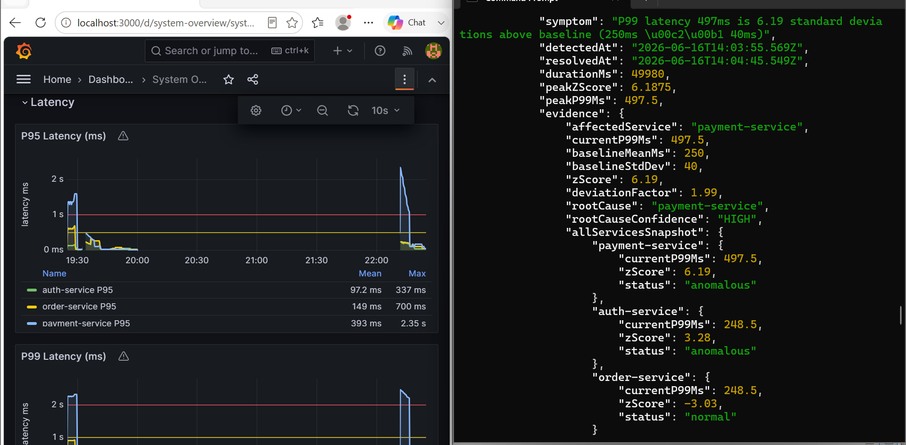

# API-Guardian: Asynchronous Microservices & Telemetry Architecture

API-Guardian is a resilient, containerized backend infrastructure designed to process high-concurrency transaction workflows, manage decoupled asynchronous queues, and run autonomous real-time anomaly detection.

The platform relies on statistical variance analysis ($Z\text{-Score}$ algorithms) instead of static thresholds to flag downstream dependency failures and resource contention without human intervention.

---

## 📐 System Architecture

This project operates strictly as an infrastructure system layer. Below is the internal network topology mapping the synchronous identity boundaries, the durable message broker queues, and the automated observability plane.

```mermaid
graph TD
    %% Nodes
    Client([Load Test Script])
    Order[Order Service]
    Auth[Auth Service]
    Queue[(Redis / BullMQ)]
    Payment[Payment Service <br/><i>Failure Simulator</i>]
    
    %% Telemetry Layer
    subgraph Telemetry Layer
        Prom[Prometheus Scraper]
        Grafana[Grafana Dashboard]
        AI[AI Anomaly Service <br/><i>Z-Score Engine</i>]
        DB[(In-Memory Incidents)]
    end

    %% Flows
    Client -->|HTTP POST Loop| Order
    Order -->|Sync HTTP JWT Auth| Auth
    Order -->|Async Queue Enqueue| Queue
    Queue -->|Worker Polling| Payment
    
    %% Metrics Flows
    Auth -.->|Metrics Scrape| Prom
    Order -.->|Metrics Scrape| Prom
    Payment -.->|Metrics Scrape| Prom
    
    Prom --> Grafana
    Prom -->|Telemetry Stream| AI
    AI -->|State Persistence| DB

    %% Styling
    style Telemetry Layer fill:#1f1f1f,stroke:#333,stroke-width:2px,color:#fff
    style Payment fill:#a32a2a,stroke:#ff5555,stroke-width:1px,color:#fff
    style AI fill:#1a5f7a,stroke:#57c5b6,stroke-width:1px,color:#fff

    ## 📊 Live Telemetry & Incident Logs

> [!NOTE]
> Below is the diagnostic state captured when a $40\%$ artificial fault rate was injected into the payment isolation zone while under a $60\text{-order}$ bulk traffic load loop.

### 🔴 Metrics Outage Spike & Automated Detection



* **Telemetry Proof:** The visualization shows `order-service` and `auth-service` P99 latencies shifting upwards and plateauing at **453ms** under high-concurrency pressure, followed by a graceful drop to baseline once the queue cleared.
* **Cascading Failure Visibility:** Due to synchronous dependencies on the identity ingress check, the downstream failure caused transit socket exhaustion that surfaced an error rate spike up to **72%** within the metrics monitoring pipeline.

---